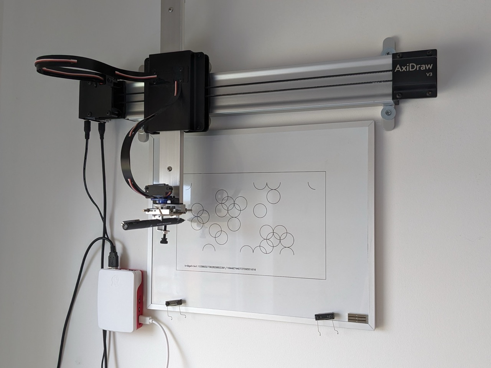

# bridget-bot

A plotter program to imitate Bridget Riley's 'Composition with Circles'. Uses [axidraw-over-http](https://github.com/bryangale/axidraw-over-http) and [hershey-parser](https://github.com/bryangale/hershey-parser).

## Running
- Install [Rust](https://www.rust-lang.org/tools/install)
- Download and run [axidraw-over-http](https://github.com/bryangale/axidraw-over-http). This program assumes axidraw-over-http is running locally on its default port, 7878
- Run with `cargo run`
